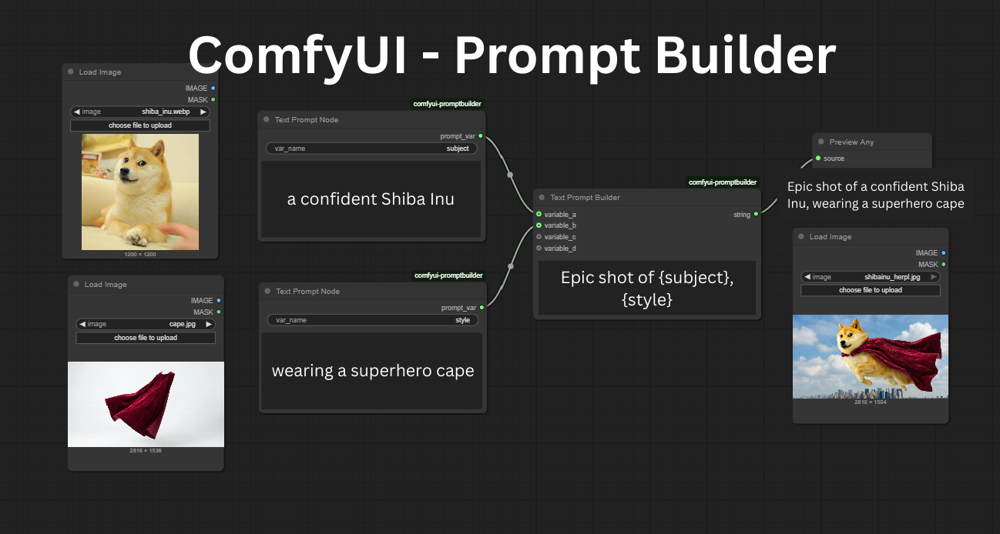

# ComfyUI Prompt Builder

Stop wasting hours tweaking prompt. This extension allows you to modularize your prompts into variables and assemble them using a powerful template-based approach.



## Features

-   **Building Blocks**: Break your prompts into smaller pieces like Subject, Style, or Artist using separate nodes.
-   **Easy Templates**: Combine these pieces using a simple "fill-in-the-blanks" system.
-   **Mix and Match**: Instantly swap out parts of your prompt to try new ideas without rewriting the whole thing.

## Installation

1.  Navigate to your ComfyUI `custom_nodes` directory.
2.  Clone this repository:
    ```bash
    git clone https://github.com/yourusername/comfyui-promptbuilder.git
    ```
3.  Restart ComfyUI.

## Nodes

### 1. Text Prompt Node
Defines a single text variable.
-   **Inputs**:
    -   `var_name`: The name of the variable to be used in the template (e.g., `subject`, `style`).
    -   `text`: The actual text content.
-   **Output**: A special `PROMPT_VAR` type containing both the name and the text.

### 2. Text Prompt Builder
Aggregates variables and combines them into a final string.
-   **Inputs**:
    -   `template`: The template string defining how to combine variables. Use `{variable_name}` syntax.
    -   `variable_a` through `variable_d`: Connect your **Text Prompt Nodes** here.
-   **Output**: The final constructed string.

## Usage Guide

1.  **Create Variables**:
    -   Add a **Text Prompt Node**. Set `var_name` to `subject` and `text` to `a confident Shiba Inu`.
    -   Add another **Text Prompt Node**. Set `var_name` to `style` and `text` to `wearing a superhero cape`.

2.  **Connect**:
    -   Connect the output of the first node to `variable_a` on a **Text Prompt Builder** node.
    -   Connect the output of the second node to `variable_b`.

3.  **Build Template**:
    -   In the **Text Prompt Builder**, set the `template` widget to:
        ```text
        Epic shot of {subject}, {style}
        ```
    -   The node will automatically combine them into: "Epic shot of a confident Shiba Inu, wearing a superhero cape".

### Template Syntax
You can reference connected inputs in multiple ways in your template:
-   **By Name**: Use the `var_name` defined in the source node (e.g., `{subject}`).
-   **By Input Slot**: Use the input slot name (e.g., `{variable_a}`, `{variable_b}`).
-   **By Short Slot**: Use the single letter of the slot (e.g., `{a}`, `{b}`).
